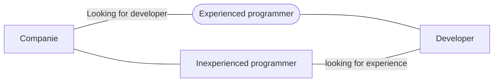

# Food app

This challenge resumes on: An idea to not only **help normal people, but also people who work with food** (either through an app like Ifood, Uber Eats or selling at their door).
It consists of an application for you to track how many portions will be the total, how much is the total value and per slice/unit along with goals to be achieved and last but not least: where you can save your recipes with all the details; from expense, income, ingredients, etc...

## API
I've used Firebase to save all data and to make authentication;
Link to API (**docs**) -> [Firebase.](https://firebase.google.com/docs)

## Technologies i've used

 - **MVVM** - Architecture choosed;
 - **Retrofit** - To get API requests;
 - **Coroutines** - Asynchronous programming;
 - **RecyclerView** - To list data;
 - **DataBinding** - To change UI data with less pollution in activity;
 - **LifeCycle** - Android lifecycle to avoid errors/crashs;
 - **Koin** - First time dependency injection to make a cleaner code;
 - **ROOM** - To save data on local DB;
 - **Firebase** - To save some data on the cloud;
 - **FirebaseAuth** - Login;

# Current state

#### That's the current state of the app, I'll try my best to keep the app true to the design and utilize all technologies i've previously listed.

### Checkboxes

 - [x] Project idea;
 - [x] Design;
 - [x] Readme;
 - [ ]  Project setup;
 - [ ]  Gradle updated;
 - [ ]  Architeture;
 - [ ]  API connection;
 - [ ]  Main screen;
 - [ ]  BottomTabNavigation;
 - [ ]  Ingredients screen;
 - [ ]  Calculations screen;
 - [ ]  Recipes screen
 - [ ]  Details_Ingredients screen;
 - [ ]  Details_Recipes screen
 - [ ]  API data;
 - [ ]  Main screen redesign with API data;
 - [ ]  Ingredients screen redesign with ROOM data;
 - [ ]  Recipes screen redesign with ROOM data;
 - [ ]  Edit, Delete and Share button enabled {**not listed as required, it's a plus**};
 - [ ]  Have the project available on Github;
 - [ ]  Publish the app on Play Store {**not listed as required, it's a plus**};
 - [ ]  Loading animation{**not listed as required, it's a plus**};

## Updates with dates
> **Note:** The dates may be a little off due to forgetting to update them in real time;

**2022** - 	*Project Idea**
**2022** - *Project Design*
**23/03/2022** - *README creation*

## Language

Which language and why did I choose?

|                |Kotlin                          |JAVA                         |
|----------------|-------------------------------|-----------------------------|
|Code			 	  |**It's not that complex**     |*A more complex and larger syntax*|            
|Popularity     	  |**It's gaining popularity after Kotlin first**            |*More popular making it easy to find guides about bugs and doubts*         |
|Community       	  |**Small community, but it's not impossible to find people**|*Huge community which makes it possible to make connections quickly* |
|NullPointerException |**The code won't work if you set it to null unless you do certain things...**|*Well well well* |

# APP Screenshot/Videos

  

  

  
  

## Diagram about companies

> Situation of companies today.

TESTES

  

  

  

  
